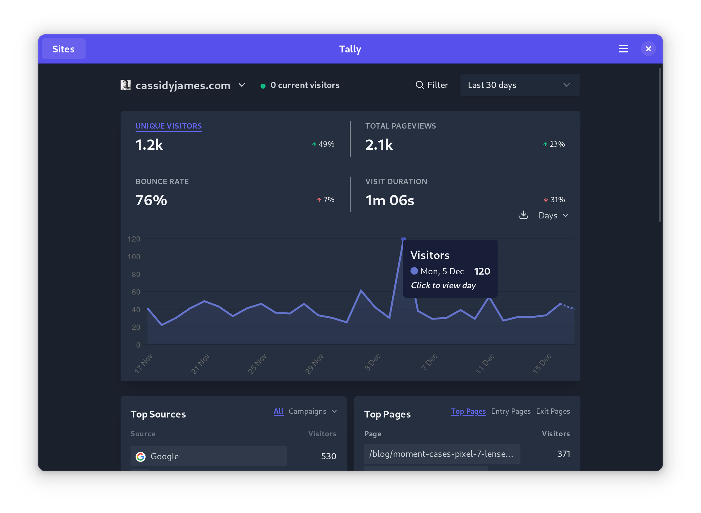

[][flathub]
[][flathub]

# Plausible

Hybrid native + web app for [Plausible Analytics](https://plausible.io).

Plausible is the simple privacy-friendly alternative to Google Analytics. This app wraps the Plausible web app in a native UI, integrating better with desktop operating systems like elementary OS. Native features include:

- Icon in your App Grid, Applications Menu, Dash, Dock, etc.
- Native header bar with buttons for account settings and logging out
- Save and restore current view, size, and position when closed and opened
- Two-finger swipe to go back/forward between views

Other features:

- Zoom in/out with Ctrl+Plus/Minus, and it's remembered the next time you use the app
- Slimmed down web app UI (no header or footer with external links)

## Developing and Building

How to build Plausible is currently undergoing a rework; for now, I recommend using GNOME Builder with default settings to build the Flatpak.

[flathub]: https://flathub.org/apps/details/com.cassidyjames.plausible
