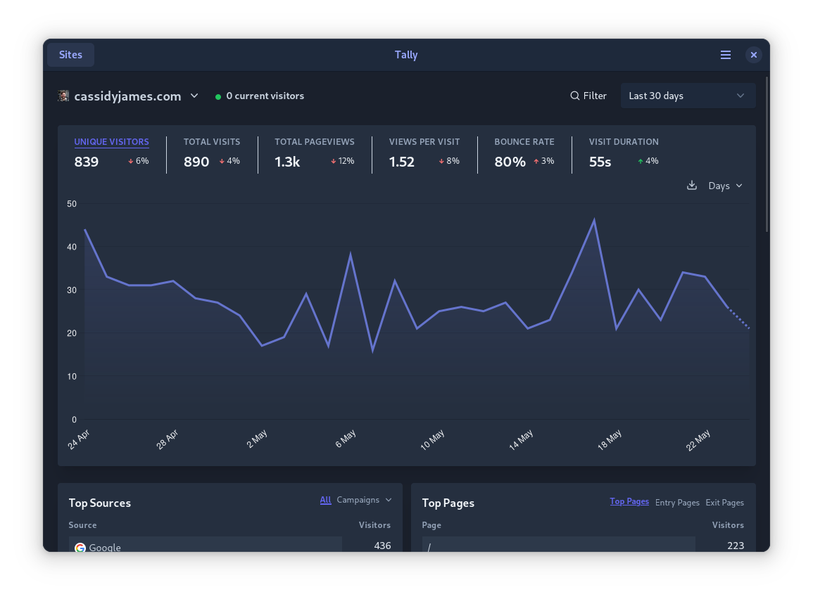
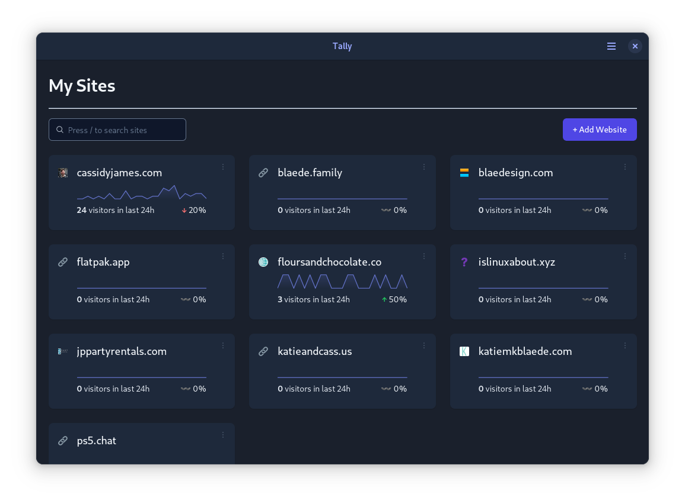
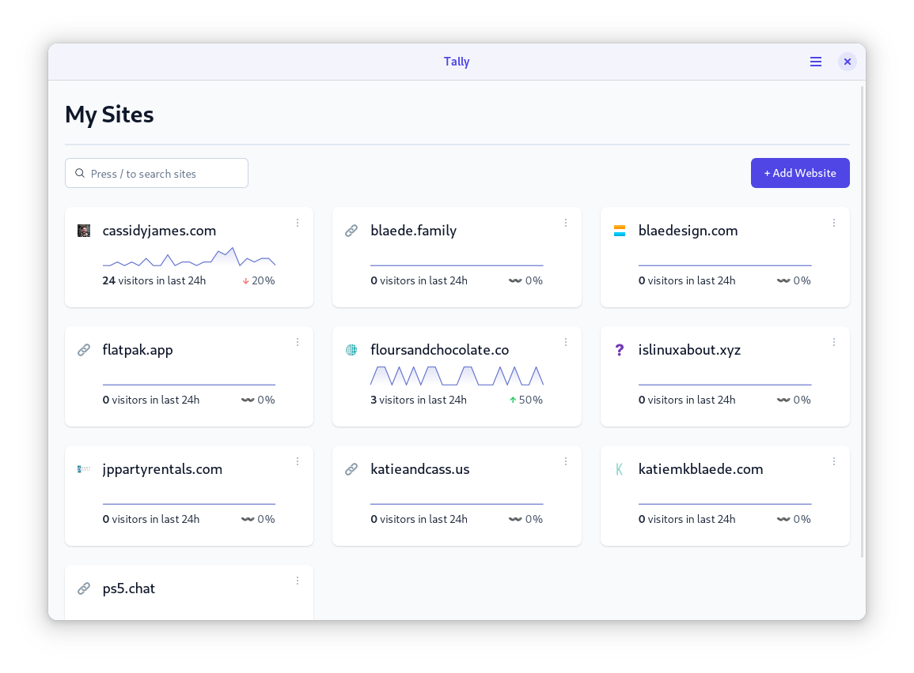

[][Only on Flathub]
[][Flathub]

# Tally for Plausible

Hybrid native + web app for [Plausible Analytics](https://plausible.io).

 | 
--------------------------------------------------- | --------------------------------------------------
      | 

Plausible is the simple privacy-friendly alternative to Google Analytics. Tally wraps the Plausible web app in a native UI, integrating better with desktop operating systems. Native features include:

- Icon in your App Grid, Applications Menu, Dash, Dock, etc.
- Native header bar with buttons for account settings and logging out
- Save and restore current view and size when closed and re-opened
- Two-finger swipe and mouse button support to go back/forward between views
- Cross-desktop light/dark style support for GNOME, elementary OS, etc.

Other features include:

- Pinch-to-zoom
- Set the scaling with Ctrl+Plus/Minus or Ctrl+0 to reset
- Slimmed down web app UI (no header or footer with external links)
- Custom domain support (e.g. self-hosted, not on plausible.io)

## Developing and Building

I recommend using GNOME Builder with default settings to build the Flatpak.

[Only on Flathub]: https://cassidyjam.es/apps#only-on-flathub
[Flathub]: https://flathub.org/apps/details/com.cassidyjames.plausible
